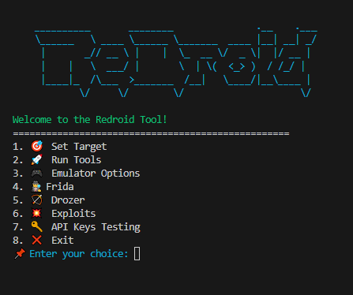

# Redroid – Android Application Pentesting Automation Toolkit for Android Studio and Genymotion

> ⚠️ **Work in Progress**  
> Redroid is under active development. Some features may be unstable or not fully compatible across environments. Contributions and issue reports are welcome.

**Redroid** is a modular toolkit designed to streamline Android application penetration testing. It automates common tasks such as:

- Installing and configuring Burp certificates and frida
- Managing proxy settings
- Integrating with tools like **Frida**, **Drozer**, **MobSF**, **Nuclei**, **ApkLeaks**, and **TruffleHog**
- Generate and sign exploits (e.g., **Tapjacking**, **Task Hijacking**)
- and much more...

Its interactive CLI interface allows operators to focus on analysis and exploitation instead of setup and configuration overhead.



---

## 🚀 Installation

### ✅ Install with `pipx` (Recommended)

You can install Redroid directly from GitHub using:

```bash
pipx install git+https://github.com/YoruYagami/Redroid.git
```

Once installed, the `redroid` command will be available globally:

```bash
redroid
```

### ⚙️ Manual Installation

1. Clone the repository:
```bash
git clone https://github.com/YoruYagami/Redroid.git
cd Redroid
```

2. Install the dependencies:
```bash
pip install -r requirements.txt
```

3. Run the tool:
```bash
python redroid.py
```

### 🧪 Development Installation

To contribute or make changes locally:

```bash
git clone https://github.com/YoruYagami/Redroid.git
cd Redroid
pip install -e .
```

---

## 📋 TODO

- [x] Multi-device support
- [x] Fix logic for existing modules (e.g., MobSF integration)
- [x] Add TruffleHog-based source scanning
- [ ] Add Firebase testing capabilities
- [ ] Add manual testing modules inside Drozer menu
- [x] Implement real-time `logcat` streaming
- [x] Automatic APK signing and patching
- [ ] Ensure full cross-platform support (Windows ↔ Kali Linux)
