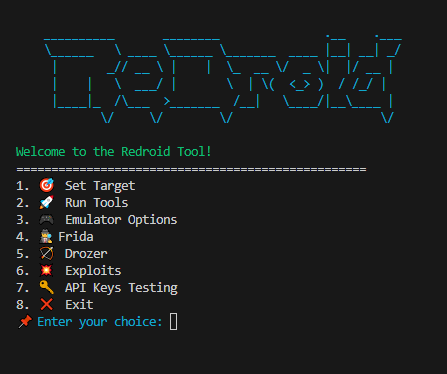

# Redroid – Cross-Platform Android Application Pentesting Automation Toolkit

> ⚠️ **Work in Progress**  
> Redroid is under active development. Some features may be unstable or not fully compatible across environments. Contributions and issue reports are welcome.

**Redroid** is a modular toolkit designed to streamline Android application penetration testing. It runs on **Windows** and **Linux** and automates common tasks such as:

- Installing and configuring Burp certificates and frida
- Managing proxy settings
- Integrating with tools like **Frida**, **Drozer**, **MobSF**, **Nuclei**, **ApkLeaks**, and **TruffleHog**
- Generate and sign exploits (e.g., **Tapjacking**, **Task Hijacking**)
- and much more...

Its interactive CLI interface allows operators to focus on analysis and exploitation instead of setup and configuration overhead.



---

## 🚀 Installation

1. Clone the repository:
```bash
git clone https://github.com/YoruYagami/Redroid.git
cd Redroid
```

2. *(Recommended)* Create and activate a virtual environment:
```bash
# Linux / macOS
python3 -m venv .venv
source .venv/bin/activate

# Windows
python -m venv .venv
.venv\Scripts\activate
```

3. Install the dependencies:
```bash
pip3 install -r requirements.txt
```

4. Run the tool:
```bash
python redroid.py
```
